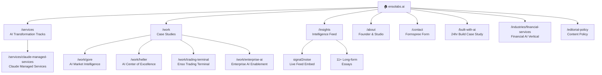

<p align="center">
  
</p>

<h2 align="center">ensolabs.ai</h2>

<p align="center">
  <strong>Production website for a principal-led AI transformation studio.</strong><br/>
  Built entirely with Claude in 24 hours. Ships production-grade infrastructure that takes traditional agencies weeks.
</p>

<p align="center">
  <a href="https://ensolabs.ai"></a>
  <a href="https://github.com/nycsav/ensolabs-site/deployments"></a>
  
  
  
  
  
  
</p>

---

## What is this?

The production website for [Enso Labs](https://ensolabs.ai) — a principal-led AI transformation studio founded by [Sav Banerjee](https://linkedin.com/in/savbanerjee) in NYC. This site is a working proof-of-concept for AI-native delivery: a single senior practitioner with Claude shipped a complete studio presence with production-grade SEO, AEO, and GEO infrastructure in under 24 hours.

This is not a landing page. It is a full studio presence with:
- **71 JSON-LD schemas** for structured data and search engine authority
- **MCP endpoint** for AI agent and LLM discoverability
- **AEO/GEO optimization** for AI answer engine and generative search inclusion
- **Dynamic OG image generation** for every case study and article
- **Live signal2noise feed** embedded from [signals.ensolabs.ai](https://signals.ensolabs.ai)

---

## Site Architecture



---

## Production Infrastructure

| Feature | Details |
|---------|---------|
| **71 JSON-LD schemas** | Organization, Person, ProfessionalService, Product, FAQ, LocalBusiness, Article, Breadcrumb, WebSite, ContactPoint |
| **MCP endpoint** | `/.well-known/mcp.json` — discoverable by AI agents, Claude integrations, and MCP-compatible LLMs |
| **Dynamic OG images** | Edge-runtime generated social previews for every case study and insight article |
| **AEO optimization** | Definition-lead sentences on every page engineered for AI answer engine extraction |
| **GEO optimization** | Structured for inclusion in Perplexity, ChatGPT, Gemini, and Claude-generated answers |
| **RSS + sitemap** | Auto-generated from content data layer (25+ URLs) |
| **GA4 event tracking** | Form submissions, share clicks, signal2noise feed interactions |
| **signal2noise feed** | Live intelligence feed embedded from signals.ensolabs.ai |
| **Mobile responsive** | Full-screen nav overlay, fluid typography (OKLCH), card reflow across breakpoints |

---

## Tech Stack

| Layer | Technology |
|-------|-----------|
| Framework | Next.js 14, App Router, TypeScript |
| Styling | Custom CSS, OKLCH color system, Inter Tight + JetBrains Mono |
| Deployment | Vercel — auto-deploy from GitHub push, live in < 60 seconds |
| SEO | 71 JSON-LD schemas, canonical URLs, dynamic OG images |
| AEO / GEO | Definition-lead sentences, MCP endpoint, LLM crawler access via robots.txt |
| Analytics | GA4, custom event tracking |
| Forms | Formspree |
| Intelligence | signal2noise — live AI signal feed |

---

## Built With AI — The 24-Hour Stack

This repo is proof that AI-native delivery is production-ready today.

| Phase | Tool | What It Did |
|-------|------|-------------|
| Strategy & Research | Claude (Opus 4) | Competitive analysis, positioning, JSON-LD schema planning, SEO and AEO strategy |
| Visual Prototyping | Claude Design | Layout, color system (OKLCH), typography, responsive breakpoints |
| Production Code | Claude Code | Every line of Next.js, TypeScript, and CSS — pair-programmed to production |
| Content Intelligence | signal2noise | Daily signals powering the Insights page |
| Browser Automation | Claude in Chrome | Vercel config, GSC verification, DNS management |
| Deployment | Vercel | Auto-deploy from GitHub push |

---

## Repository Structure

```
ensolabs-site/
├── app/                    # Next.js 14 App Router pages
│   ├── page.tsx            # Home — hero, pillars, proof metrics, methodology
│   ├── services/           # AI transformation service tracks
│   │   └── claude-managed-services/  # Claude Managed Services offering
│   ├── work/[slug]/        # Dynamic case study pages (4 engagements)
│   ├── insights/[slug]/    # Dynamic insight articles (11 essays)
│   ├── industries/         # Financial services vertical page
│   ├── built-with-ai/      # 24-hour AI build case study
│   ├── editorial-policy/   # Content and editorial policy
│   ├── about/              # Studio story + founder bio
│   └── contact/            # Formspree-connected contact form
├── components/             # Nav, Footer, ContactForm, ShareButtons, Analytics
├── lib/                    # Schema builders, site constants, insights data layer
├── public/                 # Static assets, OG images, favicons
└── scripts/                # OG image generation (Puppeteer)
```

---

## Case Studies Showcased

| Client | Outcome |
|--------|---------|
| **Fortune 500 Manufacturer** | AI Market Intelligence Platform — 731 documents indexed, 16 live signals, AES-256-GCM encryption |
| **Heller** | AI Center of Excellence — 83% faster campaign launches, FDA/MLR compliant pipeline |
| **Enterprise AI** | AI enablement program — 75% pilot-to-production conversion rate |
| **Enso Trading Terminal** | Autonomous signal intelligence + options trading platform |

---

## Deploy

```bash
git push origin master
# Vercel auto-deploys. Site is live in < 60 seconds.
```

---

## License

Proprietary. All rights reserved by Enso Labs.

---

<p align="center">
  <strong>Designed with Claude Design · Built with Claude Code · Intelligence by signal2noise</strong><br/>
  <sub>Human-in-the-loop: <a href="https://linkedin.com/in/savbanerjee">Sav Banerjee</a> · NYC</sub>
</p>
